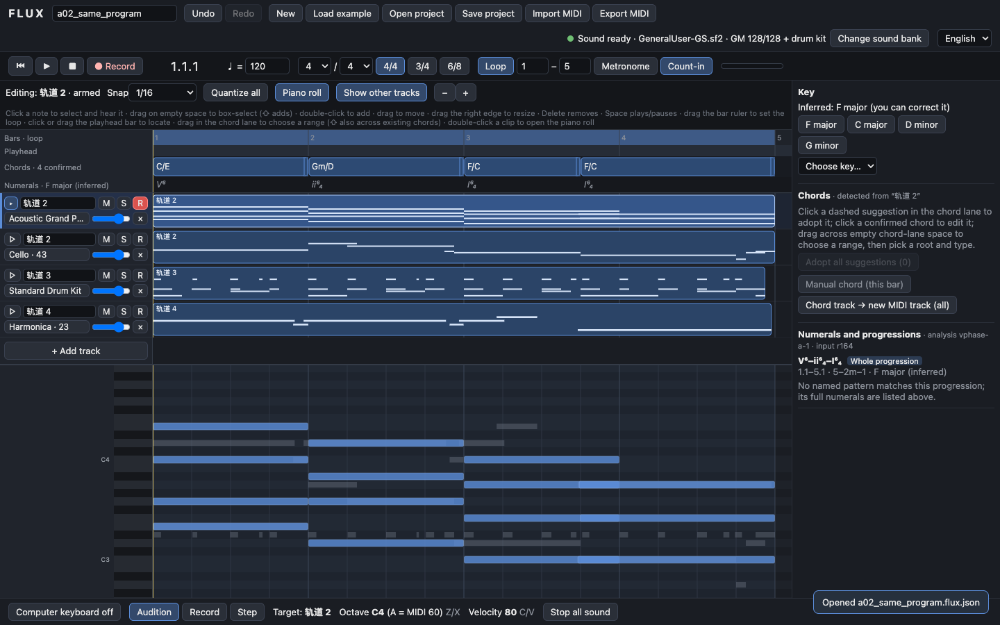

> **历史归档 · 2026-10-02 · 不作为当前执行指令。**
> 原位置：`docs/supervision-2026-09-30/FLUX_SUPERVISOR_BRIEF.md`。2026-09-30 会谈前给导师的英文背景简报。会后研究方向已改：不再以“旋律＋确认和弦→bass，并与规则 R0 比较”为主线，R0 退出研究对比；当前方向见 2026-10-02 研究设计。文中对已实现工作台的描述仍可用于“已有工作”声明，测试数字是 2026-09-29 的记录。
> 当前入口：[项目 README](../../../../README.md)；[当前研究设计](../../../../docs/research/RESEARCH_DESIGN_2026-10-02.md)；[归档纠错索引](../../../README.md)。正文保留历史原文，相对路径和旧命令按原位置解释。

<!-- ARCHIVED ORIGINAL BELOW -->
# FLUX Controllable Symbolic Music Generation

## Project and research discussion with Paul Tennent

Hanze Jin | Meeting 30 September 2026 | Prepared 29 September 2026

### 1 Project overview

FLUX is my self-proposed individual dissertation project: a MIDI composition workbench for developing music that a person has already started. My longer-term ambition is a useful creative tool in which musicians can request an accompaniment, hear alternatives alongside their original material, edit the result, and decide what becomes part of the piece. MIDI represents editable musical events such as pitch, timing and instrument; the browser synthesises those events into sound.

For the dissertation, I propose to investigate **controllable symbolic music generation through an interface that makes the user's musical decisions explicit**. AI and music generation are my primary research interests, with HCI forming an essential part of how those controls are expressed, understood and revised. A promising first task is to add a bass part to a short melody and a user-confirmed chord sequence, within a selected range of bars, while preserving the existing composition.

**The current web application is a working editor and harmonic-input platform. It does not yet generate model-based accompaniment.** It supports audible multitrack playback, computer-keyboard recording, note editing, MIDI exchange, chord recognition and manual chord entry. A separate Python research pipeline has previously generated MIDI using the Anticipatory Music Transformer (AMT). Connecting reliable generation to the editor, and evaluating its usefulness, remain the central work ahead.

I would like to agree a research scope that is substantial enough for the dissertation and produces a credible body of work by November–December for postgraduate applications. My proposed autumn outcome is a reproducible prototype, a controlled evaluation, and clearly explained findings, supported by musical examples. I would welcome a paper opportunity if the results justify it; publication is not a prerequisite for completing the project.

### What I would like to decide in this meeting

1. Whether the strongest contribution is a study of chord-conditioned generation and decoding, with the interaction design evaluated alongside it.
2. What evidence is sufficient to assess musical usefulness and user control, and whether a small participant study is feasible.
3. How much implementation and evaluation is realistic by December, and what should continue into the final dissertation period.
4. How to document the existing prototype as prior work and distinguish the new contribution undertaken for the module.

The rest of this brief separates the implemented system, evidence and limitations, and a proposed research plan. The new research scope and dates are discussion proposals; the repository's current implementation order remains in `docs/RESEARCH_RESET_2026-09-26.md` until a decision is recorded.

<!-- pagebreak -->

### 2 The current web application

The September work has established a local browser environment in which music can be entered, heard, corrected and saved. This makes it possible to inspect future model output as part of an actual composition rather than judging a MIDI file in isolation. The implementation is on branch `phase-a`, commit `7484788a90271f84909a0fa602a7f65ceb2ed3b9`.

| Area | Implemented behaviour | Boundary |
| --- | --- | --- |
| Playing and recording | Computer-keyboard audition, real-time recording, step entry, count-in and metronome | External MIDI keyboards are not integrated |
| Editing and arrangement | Multitrack rows, piano roll, selection, move, resize, delete, quantise, undo and redo | One active clip per track; no general audio workstation or plugin host |
| Sound and transport | Local SoundFont playback, GM instrument selection, drums, separate track channels, mute, solo, volume, looping | SoundFont must be available locally; fixed project tempo and meter |
| Harmony | Chord candidates, manual root/type/bass, confirmed chord events, key candidates, Roman numerals and progression labels | Rule-based analysis; no validated general harmony understanding or melody harmonisation |
| Files and presentation | Project JSON, MIDI import/export, English and Chinese interface | JSON preserves FLUX harmony metadata; ordinary MIDI does not |

*Current application, captured on 29 September. Track names belong to the saved session and remain in their original language when the interface is changed to English.*

The “chord track to new MIDI track” action expands confirmed chords into fixed block voicings. It is useful for audition and editing, but is neither a learned accompaniment model nor the planned R0 role-pattern generator. There is currently no generation button, candidate acceptance workflow or model-backed request in this interface.

<!-- pagebreak -->

### 3 How the implementation works

**Browser application.** React 19 and Vite provide the interface. Most musical state and editing are implemented as local JavaScript functions. The project format uses 960 integer ticks per quarter note, explicit tempo and time signature, stable track/note identifiers, and a separate chord track. This separates the user's composition from a particular model's event encoding. Musical edits pass through an undo history; a revision field provides groundwork for detecting outdated generation results.

**Audio.** One Web Audio `AudioContext` drives a SpessaSynth `AudioWorklet` synthesiser. A worker wakes the scheduler approximately every 25 ms, scheduling events 120 ms ahead against the audio clock. These are implementation settings, not measured human-perceived latency. Each project track receives its own synthesiser channel, including tracks with the same instrument, so their note releases and mute controls remain independent. Recording maps keyboard-event timestamps to the audio output clock where the browser supports it. A local SoundFont supplies the sounds and can be cached in IndexedDB.

**Harmony analysis.** A shared dictionary defines 15 supported chord types, spellings, candidate matches and preview voicings. Detection segments a pitched track into spans of sounding notes and matches pitch-class sets. Key analysis combines weighted pitch-class profiles with chord-fit and cadence heuristics, then derives Roman numerals and selected progression patterns. These scores rank possibilities; they are not calibrated probabilities. A monophonic melody does not determine a unique chord progression. Confirmed chords are explicit project data; inferred analysis is derived information and does not silently overwrite them.

**MIDI exchange.** The `midi-file` package reads and writes Standard MIDI Files. Export gives pitched tracks separate channels and retains note velocity, tempo and meter within the supported representation. Import reports losses such as tempo changes, unsupported controllers or pitch bend. Current single-port export allows up to 15 pitched channels; multiple drum tracks share channel 10 after confirmation. The JSON project remains the authoritative format for chord intent and source metadata.

| Code path | Current responsibility | Connection to the web application |
| --- | --- | --- |
| `frontend/src/` | Editing, harmony analysis, audio and file exchange | Active |
| `backend/main.py` | FastAPI static-page service and legacy random `/api/suggest` endpoint | Serves the page; endpoint is unused by the current UI |
| `research/` | PyTorch/Transformers AMT inference, instrument mask, MIDI output and MusPy features | Separate offline experiments |
| `core/transforms.py` | Six exact motif transformations using rational beat durations | Separate library; no current UI integration |

The six transformations are sequence, inversion, retrograde, augmentation, diminution and fragmentation. They offer precise editing operations, but are not a prerequisite for accompaniment generation. Installed packages such as `peft` do not indicate that fine-tuning has been implemented. FLUX has not trained a music model.

<!-- pagebreak -->

### 4 What has been learned and what remains unresolved

AMT is a pretrained symbolic model that conditions generation on fixed musical events using its anticipation mechanism. Its original research includes accompaniment and infilling [1]. In FLUX, the Python pipeline reads a piano melody as control events, calls the model, combines the generated events with the controls, exports MIDI and computes descriptive musical features. The existing instrument intervention masks note-token logits outside an allowed instrument set.

The historical pilot contains four runs: small/medium checkpoint crossed with free/restricted instruments, using one melody. It established that the local generation pipeline could run. It does not establish a quality ranking: there are no repeated seeds, and the restricted conditions also change `top_p` from 0.98 to 0.95. Logged generation times range from 0.27 to 4.77 seconds, but these are single historical measurements of the sampling path, not an interactive-latency benchmark. The device field may also fail to reflect CPU fallback.

The allowed-set mask answers which instruments may appear; it does not ensure that a requested bass part is nonempty or musically useful. The September review found no bass part in either restricted pilot output. My dissatisfaction with generated music is a motivation for investigation, not yet a controlled assessment of AMT's quality.

### Technical issues to resolve before comparison

- **Time boundaries.** The current pipeline uses the latest onset as the end time. The sample melody ends at 8 seconds, while that function returns 7 seconds. The September dependency audit also identified clipping of the first 50 ms of controls. Both need explicit regression cases in a new adapter.
- **Representation and provenance.** Model conversion does not preserve all expressive MIDI information. The original track must remain in project state. Generated events and chord-conditioning events must be kept separate before any mix or MIDI export, including when their instrument, onset and pitch coincide.
- **Evaluation integrity.** Existing metrics describe the mixed output, which can hide an empty generated role behind the intact melody. Future evaluation must inspect the candidate on its own and in context. The current groove metric assumes 4/4.
- **Inference integration.** The instrument mask replaces a module-global sampler function. Web integration needs serialised inference or a safer request-local mechanism, plus cancellation and rejection of responses based on an outdated project.

Fixing these issues is necessary engineering. An improvement after several fixes would not identify which fix caused a musical improvement. The experiment must separate adapter correctness, model conditioning, decoding restrictions and output repair.

<!-- pagebreak -->

### 5 A focused research contribution

My proposed primary question is: **For short melody-conditioned accompaniment, how do explicit chord conditioning and role-specific decoding affect control compliance, musical usefulness and generation latency, relative to melody-only generation and a deterministic accompaniment baseline?**

The initial task would use four-bar phrases in 4/4, a fixed tempo per phrase, an existing melody, confirmed chords and one bass target. Eight-bar phrases and other roles would be extensions after the first experiment works. This is deliberately narrower than the editor's supported inputs. It makes failures easier to interpret and leaves room for methodological depth.

The accompanying HCI question is: **How do musicians use explicit chord confirmation and independently editable candidate tracks to express, inspect and revise their intentions when generating an accompaniment?** This connects the model's control contract to observable interaction. Section 7 proposes a bounded evaluation rather than an additional full product programme.

### Proposed technical investigation

AMT accepts musical events as controls, rather than FLUX's structured chord objects. I propose to test a documented chord-to-control encoding, then one bounded decoding intervention: restricting the target instrument and register, with a separately switchable harmonic policy. A strict chord-tone mask could provide a diagnostic contrast, but passing notes and other non-chord tones must not automatically be classified as errors. A less restrictive, role-aware policy is a candidate to investigate if the strict policy produces empty or monotonous parts. This is a proposal, not an implemented method or a claimed novel algorithm.

The first rule baseline, **R0**, would generate bass from confirmed chords using explicit rhythmic patterns, respecting slash bass notes and intentional silence. The broader product plan also includes drums, pads and two pattern styles; I propose completing and evaluating bass first. Fixed block-chord expansion already in the UI is a different operation.

AMT remains the initial learned baseline. MIDI-GPT is a possible second model because its official implementation supports multitrack and bar-level generation [2]. It should enter only after its adapter, conditioning capability and run cost are checked. No local comparison has established it as better. A piano-specialist model such as Aria answers a different continuation task and is outside the autumn core.

### Position relative to existing work

Chord-driven accompaniment already exists in Logic Pro's Session Players [3]. Cococo investigates steering generative music through voice/time selection and alternatives [4], and Expressive Communication examines model capability together with steering interfaces [5]. FLUX should therefore not claim novelty merely from a chord track, editable MIDI or accept/reject controls. Its potential contribution is a carefully evaluated method for translating explicit musical intent into bounded accompaniment, and evidence about where that control succeeds or breaks down during editing. The precise novelty claim needs a fuller literature review with Paul.

<!-- pagebreak -->

### 6 AI evaluation design

The primary comparison should hold the model checkpoint, melody, duration, rendering, sampling settings and generation budget fixed. First repair representation errors in all learned-model conditions. Do not give only the proposed method a corrected input pipeline.

| Condition | What changes | What it can establish |
| --- | --- | --- |
| R0 | Deterministic chord-and-pattern bass | A task-matched lower-complexity reference |
| M0 | Corrected AMT with melody controls only | Learned baseline and raw failure behaviour |
| M1 | M0 plus fixed chord-control encoding | Effect of explicit harmonic conditioning |
| M2 | M1 plus target-role/register decoding restriction | Effect of bounded decoding beyond conditioning |
| M3 if justified | M2 plus a specified harmonic decoding policy | Incremental control/quality trade-off |

R0 answers whether a model adds value for this task; it is not an ablation of AMT. Post-processing should be reported separately. If a repair method is tested, save the same raw candidate before and after repair and report discarded or changed notes. A system that deletes every note is structurally safe but fails the accompaniment task.

**Materials and scale.** Start with six development phrases and three fixed seeds per learned condition. With M0–M2 this is 54 learned outputs plus six deterministic R0 outputs. Use these to estimate actual run cost, diagnose failures and set the evaluation protocol. A provisional later test set is 12 additional phrases from distinct original or authorised compositions: 108 learned outputs plus 12 R0 outputs. These counts are planning targets, not collected results or a power calculation. Settings and patterns must be frozen before evaluating the held-out works; transpositions, excerpts and seeds of one composition must stay in the same split.

**Measurements.** Record raw target-role presence and nonempty-output rate; pitch, onset and note-off boundaries; harmony relationships and register; note density, sustained coverage and repetition; and source-track preservation. Every candidate actually inserted into a project must satisfy the structural contract. Report raw violation rates separately, together with rejection and repair rates. Inspect the accompaniment alone and with the melody, using the same SoundFont and rendering settings.

Measure request-to-audition time, including conversion, inference, validation and retries. Separate cold loading from warm requests. Save every candidate, failure, timeout and retry with input hashes, checkpoint revision, seed, actual device and parameters. Report first-attempt and retry-assisted results independently. Aggregate repeated seeds by composition; report uncertainty and treat a small test set as exploratory.

**Musical judgement.** MusPy features and chord-tone statistics are diagnostics, not a single musical-quality score. A blinded listening assessment, if approved and feasible, should separately rate harmonic fit, rhythmic fit and usefulness as a starting point, allowing ties and “neither usable”. Without independent listeners, my own annotated examples can support limited analysis but not a general preference claim. Counterfactual chord changes with a fixed melody provide an additional check that a model responds to the supplied harmony rather than merely receiving it in an input object.

<!-- pagebreak -->

### 7 HCI as part of the research

The intended initial users are musicians who can enter a short MIDI idea and understand basic chord symbols. This is a design choice to test, not a validated description of a user population. Supporting complete beginners would introduce additional questions about notation and music learning that may exceed the autumn scope.

The interaction has two kinds of uncertainty. A chord recogniser can offer more than one explanation of the same notes, while a generator can return a structurally valid part that fails the user's intention. FLUX should make both visible: the musician can confirm or correct the harmony before generation, then audition the result independently and choose whether to keep or edit it. A key estimate should remain distinguishable from a user decision.

### A concrete task for evaluation

A musician prepares four bars, confirms C–G–Am–F and requests a bass part. They compare it with the melody, revise the first chord to C/E, and request another version. The system should make the changed control understandable, preserve the original material and prevent an old response from silently entering the revised composition. The participant then keeps, edits or rejects the result. This tests intention, feedback and recovery within the same musical task used for AI evaluation.

### Two feasible evidence routes

**Core route.** Document the interaction rationale, use scripted walkthroughs to check whether each intended action is possible, and keep a structured record of my own composition sessions. Log acceptance, rejection, regeneration, edits and reasons when those facilities are implemented. This can identify interaction problems and explain design decisions, but developer use and automated tests do not establish usability for other musicians or increased creative agency.

**Participant route, subject to ethics and feasibility.** A small formative study, provisionally 6–8 musicians, could explore the task through observation and short interviews. Relevant evidence includes successful correction of a chord, ability to identify the preserved source, candidate-comparison behaviour, edit effort and participants' explanations of control or confusion. The sample would support formative findings, not a population-level effectiveness claim. Paul could help refine the questions, recruitment and analysis.

If we want a comparative HCI claim, compare a narrowly changed interface with the same generator and matched musical tasks, counterbalance order, and keep model-output quality from becoming a confound. A possible comparison is explicit harmony review versus automatic adoption with later correction. A simple before/after demonstration of a new model and a new UI cannot attribute an improvement to the interface.

An archived handover records that a formal user study was previously excluded because of the ethics timetable. I would like to revisit the current options with Paul rather than assume that decision still applies. Listening panels, expert evaluations and interviews can also involve human participants; their approval requirements should be established before collecting research data. Neither a study nor a claim of improved creativity is assumed in the December minimum outcome.

<!-- pagebreak -->

### 8 Proposed autumn scope and milestones

My aim is to have useful, reviewable evidence in November and a coherent portfolio of results in December, while allowing the dissertation to continue into the following term. The dates below are personal planning targets. They need to be reconciled with current module deadlines, other coursework and available time.

| Window | Proposed work | Evidence needed to move on |
| --- | --- | --- |
| 30 Sep–9 Oct | Agree RQs, assessed contribution and evaluation route; prepare proposal and ethics checklist | Written scope, exclusions, evaluation protocol outline and baseline inventory |
| 5–18 Oct | Complete bass R0 and candidate workflow; build the corrected generation contract | Independent candidate track; audition/keep/discard; unchanged source; stale/cancel checks; conversion tests |
| 19 Oct–1 Nov | Connect AMT; implement M0–M2 and run six-phrase diagnostic pilot | All runs saved; measured cost; failure taxonomy; frozen main comparison |
| 2–15 Nov | Run held-out evaluation; complete walkthroughs; participant work only if approved and ready | Reproducible result tables, representative and failed outputs, interaction observations |
| 16–30 Nov | Analyse trade-offs; write results; prepare application-facing demonstration | Stable build, concise research report, 2–3 minute video and documented limitations |
| 1–15 Dec | Consolidate evidence and interim report; undertake one justified extension if time permits | Reproducible release snapshot and next-term research plan |

### Decisions that protect depth

By mid-October, choose the human-evaluation route. If approval or recruitment cannot fit, retain the technical evaluation and design analysis and reduce the claims accordingly. By the end of the diagnostic pilot, select one model and one main comparison. Adding MIDI-GPT, another accompaniment role or a new decoding policy should have a specific evidential purpose.

If the learned generator remains unreliable, keep R0 available in the prototype and report the learned system's failure modes. This can support a useful research result if the comparison is rigorous; it does not count as successful model-backed accompaniment. If model integration slips beyond the first week of November, pause optional features and agree a reduced evaluation with Paul before consuming the analysis period.

Fine-tuning is a later decision. It is justified only if controlled experiments show a failure that conditioning or decoding cannot address, suitable data and compute are available, and evaluation remains protected. An LLM planner, Jev ranking, MCP integration, plugin hosting, cloud deployment, automatic melody harmonisation and broader DAW editing are outside the proposed autumn core. These remain possible longer-term product directions rather than simultaneous dissertation requirements.

**Responsible research.** Use original or authorised evaluation music, record model and sound-asset terms, and agree consent, storage and retention arrangements before collecting participant data. Treat unpublished compositions as material requiring permission to share. Report the limits of a small Western-tonal test set rather than generalising to all musical traditions. Track compute use and include failures so that the reported result does not depend on undisclosed selection.

<!-- pagebreak -->

### 9 Intended outputs and course fit

By December, I would like the project to be assessable through a working system and the evidence behind its claims. The intended package is:

- A versioned local FLUX prototype with an end-to-end bass-generation workflow, preserving the source composition and allowing candidate audition, rejection, acceptance and editing.
- A documented generation adapter and one bounded control method, with regression tests for timing, provenance and accepted-output constraints.
- A reproducible evaluation package: authorised inputs, split manifest, exact model versions and settings, all candidates and failures, analysis scripts, and matched MIDI/audio examples.
- A concise research report explaining the question, related work, method, results, negative findings and limitations; plus an HCI design rationale and the strongest evaluation evidence we can legitimately obtain.
- A short demonstration video and project case study showing my technical and research contribution. Any public release must distinguish my implementation from third-party models, libraries, datasets and sound assets.

The minimum credible outcome is one evaluated task with a real learned baseline and a deterministic comparator. A stronger outcome would add a well-supported decoding or conditioning improvement and independent musical or interaction evidence. A second model, another role or a paper submission is an extension. Training a new foundation model is not a requirement for demonstrating research ability.

### Mapping to the individual dissertation

The supplied COMP3003 handbook asks for a substantial individual computing project, a justified solution, evaluation and critical reflection. It allows research- and software-oriented work; the product and research elements of FLUX can therefore support the same dissertation. The handbook supplied is dated 24 November 2023. The figures below describe that document, not verified 2026–27 requirements.

| Handbook component | Stated requirement | FLUX material |
| --- | --- | --- |
| Proposal | Up to 2,000 words and four A4 sides, excluding cover | Aim, narrowed RQs, prior-work boundary, objectives, plan and references |
| Interim report | Suggested maximum 5,000 words and 15 pages; 10% | Autumn implementation, experiments, analysis and revised plan |
| Dissertation | Maximum 15,000 words and 40 main-body pages; 75% | Full method, design, contribution, evaluation and reflection |
| Demonstration | 15%; final timing announced via Moodle | Working prototype, results and ability to explain limitations |
| Video | 1–3 minutes; 1280×720 H.264 MP4 | A concise explanation of the outcome and individual contribution |

The supplied timetable places the interim report around Christmas and the dissertation around Easter of the following year. November–December is therefore an accelerated research/application milestone, not an assumed final submission date. Current deadlines, report rules and assessment arrangements need confirmation through Moodle and Paul. The proposal and ethics process should explicitly record what already exists, what is new, how source material may be used, and the relevant institutional requirements for acknowledging assistance and third-party work.

<!-- pagebreak -->

### 10 How supervision would help

I can take responsibility for implementation, experiment execution, documentation and project management. The areas where guidance would most change the outcome are choosing a defensible research question, judging the evaluation design and deciding which ambitions to defer.

Paul's work in the Mixed Reality Laboratory and interdisciplinary creative technologies suggests a useful connection to the interaction and creative-practice side of FLUX [6]. I would like to discuss that fit directly. I would also value advice on whether a music-AI or music-theory specialist should provide occasional input; no additional collaboration is assumed.

### Questions for this meeting

1. **Research identity.** Is controllable accompaniment with an explicit harmony interface a coherent individual dissertation? Which one claim should the final work be able to defend?
2. **Technical depth.** Is a corrected pretrained-model baseline, a tested control method and a rigorous ablation sufficient depth, or should a narrower algorithmic contribution be the priority?
3. **Musical evaluation.** Which evidence would you accept for musical usefulness? Is a small listening panel realistic, and who could help define the assessment criteria?
4. **HCI evidence.** Should I pursue a formative musician study, a carefully bounded comparison, or a design-and-walkthrough route within the available time? What approvals and preparation are required?
5. **Prior work and assessment.** How should the existing code and experiments be declared, and which new objectives should form the assessed contribution? Which current module deadlines should govern the plan?
6. **Resources and contact.** Could you advise on relevant literature, specialist feedback or compute access if needed? What meeting cadence and preparation would make supervision most useful?

I suggest bringing a short evidence note to each meeting: the decision needed, the relevant result or musical example, and the next experiment. A 20–30 minute discussion approximately every two weeks during the initial stages would be useful if it fits your availability; written feedback can serve the same purpose. The supplied handbook describes five hours of supervision as the minimum across the year, with document review and email also counting, so I would like to agree a realistic arrangement rather than assume unlimited meetings.

### What I will demonstrate today

In about six minutes, I can open the existing four-track project, play and solo parts, edit a note and undo it, inspect and correct harmony, expand a confirmed chord region into a new MIDI track, and save/export. This demonstrates the current composition and control platform. I will explain where model-backed candidates will enter the workflow and, if useful, show a separately labelled historical AMT output. The current browser demonstration does not establish model quality or the proposed generation workflow.

The most useful outcome of the meeting would be agreement on a primary task and RQ, the evaluation route, the prior-work boundary, and the next two weeks' deliverable. I would record those decisions before changing the current implementation plan.

<!-- pagebreak -->

### 11 Evidence and references

### Verification for this brief

On 29 September, the current implementation, dependency declarations, research scripts and dated plans were reviewed. The existing frontend suite passed **102 tests across 11 files**; the Python suite passed **25 tests**, with one existing Starlette/httpx deprecation warning. The production build succeeded, with a warning about a JavaScript bundle over 500 kB. These checks establish behaviour covered by the tests; they do not measure music quality.

The four retained browser reports from 28 September each record **56/56 checks passed**, covering Chrome and Playwright WebKit at the development and production entry points. Those reports were inspected, not rerun in full for this brief. They measure browser interaction and audio-graph signals. They do not replace human listening, and WebKit automation is not identical to testing Safari.app. The delivery records contain user-reported Safari testing and follow-up manual checks; final human listening and playing feel remain separate from automated evidence.

A fresh, limited Chrome check on 29 September opened the four-track, 76-note project at the production entry point, loaded the local SoundFont, switched the interface to English and played/paused with the spacebar. It found a nonzero audio-graph signal, 128 melodic GM presets plus drums, and no page errors. This was a headless smoke check, not a human listening test or a repeat of the full browser suite.

No new model inference, training, participant research or musical-quality benchmark was run for this brief. Historical pilot artifacts were read without being regenerated. The current legacy research runner can overwrite tagged MIDI/PNG files and append to a shared CSV; future experiments need separate run directories and immutable manifests.

### Repository reading guide

- Current direction and scope: `docs/RESEARCH_RESET_2026-09-26.md`, `docs/DAW_SPEC_2026-09-26.md` and `docs/HANDOFF_A_2026-09-27.md`.
- Implementation and verification records: `docs/PHASE_A_DELIVERY_2026-09-27.md` and `docs/PHASE_A_FOLLOWUP_2026-09-28.md`.
- Product state and harmony: `frontend/src/App.jsx`, `music/project.js`, `music/history.js`, `music/chords.js` and `music/analysis.js` under `frontend/src/`.
- Audio and interchange: `frontend/src/audio/engine.js`, `audio/scheduler.js`, `music/time.js` and `music/midi.js` under `frontend/src/`.
- Generation and pilot: `research/generate.py`, `pipeline.py`, `ab_test.py`, `metrics.py`; historical `data/results/pipeline_metrics.csv` and `data/generated/` are local artifacts.
- Earlier interpretation and corrections: `docs/research/RESEARCH_REVIEW_2026-09-26.md`; the archived supervisor handover supplies historical context, not the current scope.

### Selected external references

[1] Thickstun, Hall, Donahue and Liang. *Anticipatory Music Transformer* (2023). [Paper](https://arxiv.org/abs/2306.08620). Establishes the pretrained generation approach; it is not evidence of FLUX's performance.

[2] Metacreation Lab. *MIDI-GPT*. [Official implementation](https://github.com/Metacreation-Lab/MIDI-GPT) and [model card](https://huggingface.co/Metacreation/MIDI-GPT). The model card labels weights CC-BY-NC-4.0; any use or distribution needs to be checked against the particular assets and intended use. A future experiment must pin the exact checkpoint rather than follow a changing model alias.

[3] Apple. *Chords and Session Players in Logic Pro for Mac*. [Product documentation](https://support.apple.com/guide/logicpro/chords-and-session-players-lgcp70dd5af3/mac). Relevant product precedent for explicit harmonic control.

[4] Louie, Coenen, Huang, Terry and Cai. *Cococo: AI-Steering Tools for Music Novices Co-Creating with Generative Models* (2020). [Workshop paper](https://ceur-ws.org/Vol-2848/HAI-GEN-Paper-1.pdf).

[5] Louie, Engel and Huang. *Expressive Communication: A Common Framework for Evaluating Developments in Generative Models and Steering Interfaces* (2021 preprint). [Paper](https://arxiv.org/abs/2111.14951).

[6] Paul Tennent. [Research profile](https://paultennent.wordpress.com/about-me/). Background for discussing supervisory fit, not a commitment to particular resources or collaborators.

Web references checked 29 September 2026. Course requirements above come from the supplied *3rd Year (BSc) Project Handbook*, COMP3003, last updated 24 November 2023.
